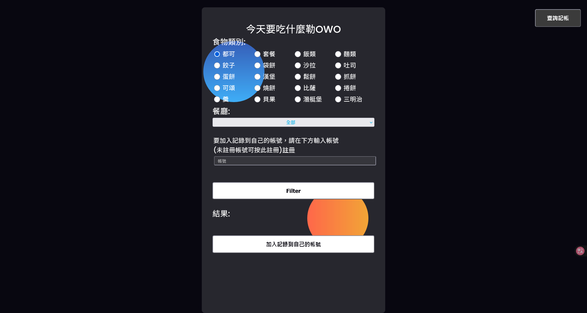
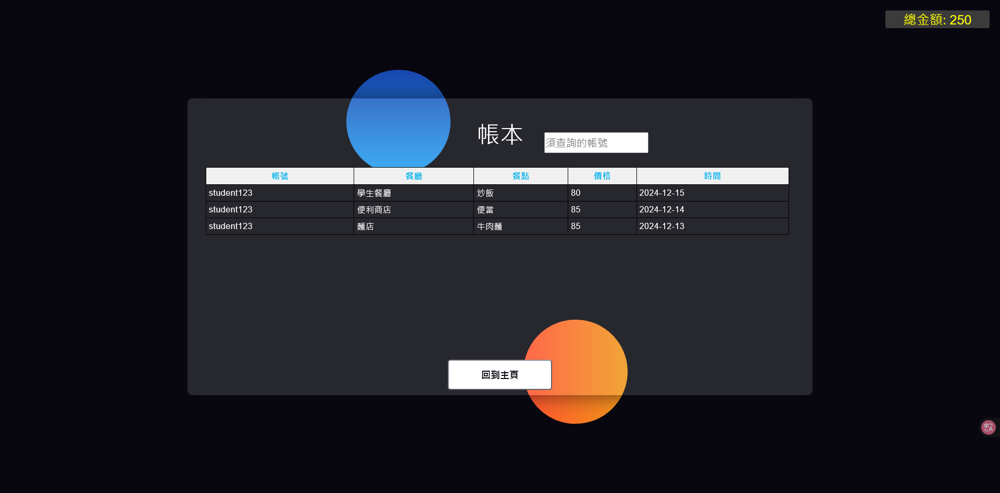

# Final_RandomSelecter - 隨機選擇器

## 靜態HTML Demo(前端畫面)
**Demo 網址**: [https://tsz7250.github.io/1111_WebProgramming_Final/](https://tsz7250.github.io/1111_WebProgramming_Final/)




## 📖 期末專題報告

校園美食隨機選擇器，提供食物類別和餐廳篩選功能的學餐隨機選擇系統。使用者可以註冊帳號，使用記帳功能，並查看過去的使用記錄及總金額統計。

## ✨ 功能特色

- **隨機選擇**: 智能推薦校園美食選項
- **分類篩選**: 支援食物類別和餐廳類型篩選
- **用戶系統**: 完整的用戶註冊與登入功能
- **記帳功能**: 消費記錄與金額追蹤
- **歷史查詢**: 查看過去的使用記錄
- **統計分析**: 總金額統計與消費分析

## 🛠️ 技術架構

- **前端**: HTML, CSS, JavaScript
- **後端**: PHP
- **資料庫**: MySQL
- **會話管理**: PHP Session
- **用戶驗證**: 登入註冊系統

## 📁 專案結構

```
Final_RandomSelecter/
├── Webpage/            # 網頁檔案目錄
│   ├── index.html      # 主頁面
│   ├── login.php       # 登入頁面
│   ├── register.php    # 註冊頁面
│   ├── selector.php    # 隨機選擇器
│   ├── history.php     # 歷史記錄
│   └── account.php     # 記帳功能
├── 期末專題報告.pdf      # 完整專題報告
├── 海報.pdf            # 專題海報
└── README.md           # 專案說明
```

## 🚀 系統功能

### 用戶管理
- **註冊功能**: 新用戶註冊
- **登入系統**: 安全的用戶驗證
- **個人資料**: 用戶資訊管理
- **會話管理**: 登入狀態維護

### 隨機選擇器
- **食物分類**: 依類別篩選美食選項
- **餐廳篩選**: 選擇特定餐廳類型
- **隨機推薦**: 智能推薦演算法
- **選擇記錄**: 自動記錄選擇結果

### 記帳系統
- **消費記錄**: 記錄每次消費金額
- **分類統計**: 依食物類別統計支出
- **時間查詢**: 依日期範圍查詢記錄
- **總額統計**: 計算總消費金額

### 歷史功能
- **使用記錄**: 查看過去的選擇記錄
- **消費歷史**: 檢視消費明細
- **統計圖表**: 視覺化消費趨勢
- **資料匯出**: 匯出記錄資料

## 💡 使用流程

1. **註冊/登入**: 建立帳號或登入系統
2. **設定篩選條件**: 選擇食物類別或餐廳類型
3. **隨機選擇**: 系統推薦美食選項
4. **記錄消費**: 輸入實際消費金額
5. **查看統計**: 檢視消費記錄和統計資料

## 📊 資料統計

- **消費分析**: 每日/每週/每月消費統計
- **類別統計**: 各食物類別消費比例
- **餐廳偏好**: 最常選擇的餐廳統計
- **趨勢分析**: 消費趨勢變化

## 🎯 專題目標

- 解決學生選擇困難的問題
- 提供便利的校園美食推薦
- 幫助學生管理餐飲支出
- 建立個人化的飲食記錄

## 📋 技術特色

- **響應式設計**: 支援手機和電腦使用
- **資料庫設計**: 正規化的資料表結構
- **安全性**: 密碼加密與SQL注入防護
- **用戶體驗**: 直觀的操作介面